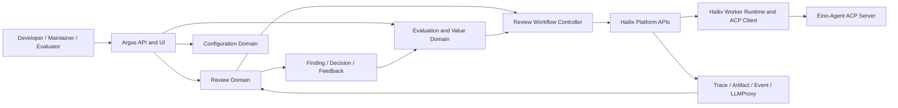

# Argus Technical Design

**Status:** M1.3.4 fenced recovery + exact repository-search/compile evidence
**Last verified:** 2026-08-27

## 1. 架构结论

Argus 采用“垂直领域控制面 + 通用执行平台 + 可替换 Agent Runtime”的结构：



Argus 只拥有 Code Review 语义。身份、Workspace、WorkingCopy、容器、ACP transport、
通用 Trace 和模型代理属于 Hailix。Eino-Agent 是执行者，不是评审业务状态机。

## 2. Bounded Context

| Context | 聚合/实体 | 责任 |
|---|---|---|
| Review Intake | ReviewSpec, TargetSnapshot | 规范化 diff/selection/scope 并冻结目标 |
| Review Policy | ConfigRevision, ConfigBundle, ConfigResolutionReceipt, AgentReviewPolicy, RulePack | 解析作用域、版本、发布和有效配置 |
| Review Execution | ReviewRun, StageRun, ExecutionSnapshot, AgentStagePlan | 执行领域 DAG、管理重试/重放/fencing |
| Finding | Finding, Evidence, FindingDecision | 候选、验证、去重、裁决与发布 |
| Feedback | Feedback, Outcome | 收集人工/系统结果并管理归因窗口 |
| Evaluation | Dataset, EvaluationCase, ReplayRun, ExperimentRun | 样本治理、重放、对比和 promotion gate |
| Value | MetricObservation, ValueObservation | 质量、成本、时延、采用和收益证据 |
| Integration | PlatformBinding, PublisherReceipt | Hailix、代码平台和外部工具 anti-corruption layer |

跨 Context 通过 ID、不可变引用和领域事件协作，不共享可变实体。

## 3. ReviewRun 主链路

```mermaid
sequenceDiagram
    participant Client
    participant Argus
    participant Config
    participant Hailix
    participant Agent as Eino-Agent
    participant ArgusStore
    participant HailixStore

    Client->>Argus: Submit ReviewSpec
    Argus->>Config: Resolve and publish ConfigBundle
    Argus->>ArgusStore: Persist TargetSnapshot and pre-dispatch ExecutionSnapshot
    Argus->>Hailix: Dispatch immutable StageInputRef
    Hailix->>Agent: ACP session and prompt
    Agent-->>Hailix: ACP updates and tool evidence; target adds typed result
    Hailix-->>HailixStore: Persist Trace and Artifact
    Hailix-->>Argus: Platform identities and supported result refs
    Argus->>ArgusStore: Append PlatformExecutionBinding and RunEvidence
    Argus->>Argus: normalize, verify, adjudicate
    Argus->>ArgusStore: Finding, Decision, Feedback, Outcome
    Argus-->>Client: report or guarded publication
```

上图是目标契约，不表示当前三仓已贯通。当前 Hailix DirectTaskInput 只能用于
loopback smoke，不能冻结 Argus stage input；Artifact content 可通过受支持 API
读取，但原始 Trace/TraceManifest 尚无稳定公共读取契约。

### 3.1 阶段契约

每个 StageDefinition 固定：

- `stage_id` 与 implementation version；
- input/output schema；
- `depends_on`；
- executor kind 与 capability requirements；
- budget/timeout/concurrency；
- retry、fallback 和 partial policy；
- `ToolInvocationPolicy`：工具/参数、path/network scope、单次 deadline、输出上限、
  并发/委派深度、取消传播、截断证据和分类 retry/backoff/idempotency；
- replayability 与 required snapshot refs；
- side-effect classification。

只有 `publish` 和未来显式 `apply` 阶段允许外部副作用。Detect、Verify、Adjudicate
和所有 ReplayRun 必须是无远程写入的。

Stage 通过 typed result sink 写结构化 Artifact；自然语言 assistant message 只作
解释性输出。若底层 Agent 不支持 schema-constrained result，该 adapter 不能进入
自动发布路径。

当前 local deterministic implementation 使用一条十阶段严格 artifact chain：
`materialize_target -> plan_context -> detect -> normalize -> verify -> adjudicate -> report
-> publish -> capture_feedback -> export_evaluation`。每个 `StageResult` 绑定 stage revision、
input/output contract、target/input/artifact digest；workflow/config budget/retry/side-effect/
replay policy 会在 application admission 中交叉校验。后三个领域阶段目前只生成明确的
`remote_disabled`、`awaiting_feedback`、`candidate_only` lifecycle fact，不表示远程评论、
反馈或评测标签已经发生。local runtime 仍强制线性单 executor，尚无 detector fan-out/
fan-in、production typed result sink 或动态 stage registry。

formal `detect` 当前使用封闭、稳定顺序的 registry：fixture marker detector 用于平台
回归，Go AST detector 在冻结目标内识别 discarded `context.CancelFunc`，并对内容缺失或
parse failure 追加 coverage gap。RulePack 可以显式启停已注册规则；未注册 detector/rule
失败关闭。它尚不包含编译/测试、repository/CodeGraph、LLM 或多 Agent detector；Pi
shadow runtime 的 Hypothesis 也不会旁路进入这条 formal chain。

### 3.2 S1 formal Agent Stage 规划边界

S1 在实际执行之前增加一条受治理、无 I/O 的规划链：

```text
ResolutionContext
  -> GovernedConfigProvider.ResolvePublishedWithReceipt
  -> same-call ConfigBundle + ConfigResolutionReceipt
  -> AgentComponentResolver(exact governed identities only)
  -> pure AgentStagePlan compiler
  -> canonical AgentStagePlan
```

`AgentReviewPolicy` 是 ConfigBundle 的可选 typed section。只要任一 scope 开始配置该
section，最终解析结果就必须闭合 agent/provider/model/prompt/API protocol、按 stable ID
有序合并的 Skill/Knowledge、权限与完整预算；至少有一个 review-phase Skill。当前权限
语义固定为 provider broker model egress、tool network deny、frozen-input-only read、
workspace/remote write deny 和 delegation depth 0。模型 credential 仍只允许 secret ref，
且 component resolver request 与 `AgentStagePlan` 都没有 credential 字段。

`ConfigResolutionReceipt` 绑定 exact resolution context、ConfigBundle identity/digest 和每个
applied published revision 的 revision digest、publish event/sequence/time 与 rollout
assignment digest。它是 **local governance record**，不是数字签名，也不是 Hailix/远端
attestation；仅调用其 `Validate`/`ValidateAgainst` 只能证明记录内部一致，不能证明 ledger
中确实存在相应发布。正式 planning 的信任边界是 authenticated host adapter 注入的
`AgentPlanningSubject` 与 `GovernedConfigProvider`：应用层必须先校验该 subject 的 tenant/
organization/workspace/repository 与 ReviewRun/ReviewSpec/resolution context、repository
provider、invocation 及 selection/non-selection path scope 全部匹配，再访问配置或 component
provider；provider 必须从同一受信配置 lifecycle projection 的一次调用返回 bundle 与
receipt。`AgentPlanningSubject` 只是已验证身份的内存投影，不是 authentication token；legacy
`ConfigProvider.ResolvePublished` 也不足以进入该入口。

应用层随后把完整已准入 subject 与 policy 中的 governed identities 一并交给
`AgentComponentResolver`，并要求返回 exact content-addressed
agent/provider/model/runtime/prompt/API protocol、按原配置顺序排列的
Skill/Knowledge/context-provider adapter，避免 resolver 成为跨 workspace confused deputy。
模型组件使用严格 `ModelProfile` 契约分离两种身份：`provider_id` 是 Argus registry 可安全
寻址的内部标识，`wire_model` 是发给 provider 的不透明、逐字节保留模型名。bootstrap 以 profile
正文 digest 派生安全 component ID，formal host 解析并交叉校验 provider binding 后才把 exact
`wire_model` 降低到 worker；worker 回显或结果中发生任何模型替换都会失败关闭。这样兼容
`deepseek-v4-pro[1m]` 一类不满足 registry ID 语法的真实模型名，也不允许用“兼容 API”掩盖
provider/model wire contract 漂移。
纯 compiler 重新闭合：

- ExecutionSnapshot、MaterializedTarget、ConfigBundle、receipt、workflow、ReviewSpec 和
  ReviewInput 的 contract/SHA-256/size 与交叉 identity；
- diff/selection/scope 内容、文件 manifest、配置 path include/exclude 与 Target 边界；
- policy、workflow authority ceiling、ExecutionSnapshot tool policy 与各层预算；
- runtime component、ExecutionSnapshot `build_identity`、所有 component artifact 及其顺序。

成功结果是 canonical `AgentStagePlan v1alpha1`。其 full SHA 绑定完整 publication/run
lineage；独立 behavior SHA 绑定会改变执行行为的 stage/target/input、exact components、
runtime/build、authority、budget 和 output semantics。输出只能是
`ReviewHypothesisSet v1alpha1`，并固定 `hypothesis_only` 与 `side_effects=deny`，所以 Plan
本身不能创建 Candidate/Finding、发布评论或授权 Apply。

formal execution 在该 planning baseline 后建立本地 ledger：Plan 与冻结来源以 admission
fact 固化；canonical `StageExecutionRequest` 先通过 preflight，再提交唯一 dispatch claim；
execution binding 只能闭合 exact attempt/generation/fence/capability。provider result 必须先经
独立 callback verifier，再登记 proof-redacted callback receipt，随后才与 cancellation 竞争同一
terminal GateID；只有成功 gate 才能产生 `ReviewHypothesisSet` evidence。过滤前事实、receipt、
result、output、可选 trace 都保留独立 provenance，exact retry 从本地 closure 恢复。
当输入含至少一个 review group 时，formal succeeded 还要求至少一个 group 的全部 review task
真实完成；若所有 group 都因 provider/auth/dependency failure 未完成，即使 worker 返回结构化
partial report，host 仍以稳定 `pi_no_review_completed` 失败关闭，不能把“零次有效评审”解释成
成功的零 Finding。

本地 composition 已由 `formalreview + piexecution + agentadapter + scheduling` 接通：bootstrap
对 Node/worker/Skill bytes 建立 manifest 与 subject-bound component/config publication；run 只从
冻结 artifact 降低 worker request；show 与终态 run retry 从 terminal gate/result/evidence 恢复，
不会再次调用 provider。worker succeeded/failed 两条完整 CLI E2E 都经过真实 admission 组件。
默认 builtin review pack 已拆成 correctness、concurrency-data、error-contract、
resource-lifecycle、security-contract、transaction-state 六个职责分离的 dimension；每个
Markdown 自声明的 `builtin-vN` revision 与正文 SHA-256 共同成为 component identity。Plan/worker
上限为 16，默认 pack 外的 repository/business-line Skill 仍必须通过受治理 component/config
发布。运行 admission 以实际 group 数计算 context+review base task，并按 `max_candidates`
为 independent verifier 预留最低 model-turn 容量；默认 turn budget 相应为 96。
Node runtime、Pi worker 和 worker-owned grouping/context/verifier 等 build-bearing component 的
revision 使用 `base-<artifact digest prefix>`；legacy base revision 只保留严格读取兼容。bootstrap
先按 exact ref 解析、仅在缺失时发布，因此不同时间重跑不会改写既有 component publication。
ConfigRevision 则由完整配置语义独立寻址，不能复用 runtime manifest digest；预算、模型、prompt、
Skill 或 Knowledge 的实际变化都会生成新的配置 revision。

成功 Hypothesis evidence 随后进入确定性治理投影：所有 canonical occurrence 成为 Candidate；
最新独立 verifier observation 为 confirmed 时才生成 Finding；rejected/inconclusive Candidate
仍保留但不会变成 Finding。MVP `FindingDecision` 固定为 `queued_for_human`；不可变 Report 的 confidence
仍为 `not_calibrated`，独立 Calibration/Suppression ledger 可在 exact policy 下补充后置事实，但不会授权
comment/Apply，也不生成 Feedback、Outcome 或 evaluation
label。JSON/Markdown 是 content-addressed artifact；formal terminal 不复用 `ReviewRun` 的
deterministic report family，而是以独立的
`HypothesisSet/GovernedReport/GovernedMarkdown` formal report family 提交。Finalizer 只从冻结
snapshot、dispatch intent、execution binding、terminal gate 与 hypothesis evidence 重建
StageAttempt/RunEvidence，追加同一 run ledger 后交给 Repository 做 whole-closure 校验；成功、
失败和取消最终都成为通用 history/show 可消费的 terminal `ReviewRun`。formal exact replay 会从
committed succeeded formal source 冻结 source/root/namespace/`variable=none` lineage，复用源
target/config/workflow/runtime/tool policy，重新执行唯一 stage；formal budget replay 则派生一个
receipt-bound ConfigBundle，只原子改变外层 stage 与 Pi agent 的同一 timeout。两种模式都不读取
mutable config latest；model replay 则只改变 model component 和对应 manifest build identity，
保持 runtime-file evidence、authority 与预算不变；prompt replay 只改变 exact governed prompt
component 和对应 build identity，保持 model、runtime-file evidence、tool policy、authority 与预算
不变；skill-pack replay 只替换同 ID/phase/顺序的 exact governed review-skill Artifact，保持配置
provenance、runtime、model、prompt、tool policy、authority 与预算不变。新增、删除或重排技能必须
走正常 ConfigRevision 发布；knowledge-pack replay 以相同规则冻结 ID/顺序并只替换 exact knowledge
Artifact。rule-pack replay 只替换 exact sealed `RulePack`：Plan 同时绑定语义 VersionedRef 与 canonical
base64 bytes，Go host、TS worker 都重算语义 digest，Pi 将其作为不可信但受治理的判据输入交给
context/review/verifier；该输入不能扩张工具、凭据、副作用或输出 contract。所有模式固定
`eval_replay` workload 且 deny remote writes。

这仍不是 production executor：Argus 已有正式 `PlatformPort` consumer adapter、安全 HTTP
client、request-time environment credential port、`agent-review formal run/replay` 的显式
`hailix-http` composition 和 loopback contract harness，但 Hailix 尚未实现对应 public
service、远端 IAM trust root、provider-authoritative create-or-return-one-handle 或 runtime attestation。
dispatch claim 与 terminal admission 已由本地 shared generation CAS 串行化；HTTP ensure 的
transport/5xx/损坏响应会保留为 unknown outcome，并只用已持久化的 exact request 恢复。
provider-side atomic idempotency/outbox 仍是 Hailix 平台边界。为避免“声明 exact
但没有绑定执行语义”，当前 compiler 只接受已闭合的 same-input exact replay、budget-only、
model-only、prompt-only、skill-pack-only、knowledge-pack-only 或 rule-pack-only variant；对 `depends_on` 非空、reused checkpoint、其他 variant 和 workflow/config
`max_attempts != 1` 继续失败关闭。

### 3.3 并发

- 切片 detector 可并行，单个 StageRun 输出写入独立 namespace。
- 聚合阶段只消费已终态且 checksum 验证通过的上游 Artifact。
- 并发完成顺序不能决定 Finding ID；ID/fingerprint 由规范化内容和 anchor 计算。
- ReviewRun/user cancel 使用 run-level fencing：阻止未来 stage 调度、取消所有活跃
  子 attempt，并禁止该 run 的 publish。
- attempt timeout 只取消 exact generation；retry 创建新 fencing token。旧 generation
  的迟到 callback、tool result 和 terminal 必须丢弃，不能误伤新的 AgentTurn。
- 不允许脱离 parent lease 的 background child；需要委派时必须成为有身份、可取消的
  子 StageRun/Attempt。

### 3.4 Workload 隔离与背压

`incremental_mr`、`interactive`、`full_scan`、`eval_replay` 使用独立 workload
class。调度策略冻结 resource pool、tenant quota、priority/fairness、queue limit、
starvation protection 和 admission timeout；在线 workload 保留最低容量，full scan
与 replay 只能消费其配额或明确的可抢占余量。队列深度、拒绝、等待、抢占和配额耗尽
必须进入结构化 metrics。当前本地 repository 已执行四个 class pool、global/class/tenant
queue bound、tenant active/queued quota、priority bias、tenant fairness 与 starvation aging；
admitted/queued/rejected/throttled 均是 ledger fact，不靠进程内计数推断。

只读 `PressureSnapshot` 使用 `argus.workload_pressure_snapshot.v1alpha1`，绑定 exact policy
revision/SHA-256、ledger sequence 与显式 UTC `observed_at`，并按 global/class/tenant 对账
queue/active limit/depth、oldest pending wait、capacity state、admission/state counters 与
requires-reconcile stale counters。读取不运行 reconcile，不会把过期 pending/lease 悄悄改成
其他状态。CLI `workload pressure` 拒绝创建不存在的 store；本地 HTTP
`GET /v1/workloads/pressure?at=...` 复用 `review_read` 且读取 API process 已持有的 exact
scheduling repository。这仍是 local projection，不是 Hailix 多实例资源池或平台 attestation。

当前本地 production CLI 已把同一 state root 下的 durable workload repository
接到 `Review`/`Replay`：ExecutionSnapshot 完成后按整个 run 提交一个 workload，
同步 local worker 只 claim 当前排队顺序允许的 exact workload；每个 stage 前后通过
同一 lease heartbeat 交叉校验 generation/fencing token，stage binding 的 fencing
token 以该 run lease 为来源，最终成功/失败 callback 或永久 cancel fact 与 terminal
run 对齐。这只是 **run-level durable coordinator**，不是 stage fan-out scheduler，
同步 deterministic CLI 路径仍不提供进程崩溃后的 stage checkpoint resume、远程 worker
接管或 Hailix runtime 能力；下述异步 ReviewJob scope 与 formal Pi 路径分别提供受限的
shard checkpoint 和 Pi group checkpoint，不能外推为任意 DAG stage recovery。

异步 `deterministic_review_v1` 的 scope 路径已增加 Argus 自有的 full-scan 执行层：在
ExecutionSnapshot 中冻结 `ReviewShardManifest`，每个 shard 使用独立、内容寻址的
ReviewInput；文件按稳定路径只出现一次，不能执行的文件成为显式 coverage gap。shard
并行度受冻结 stage/config budget 双重限制，checkpoint 绑定外层 ReviewJob lease 的
attempt/generation/fencing token；重启只执行 pending shard，旧 generation 的迟到写失败
关闭。全部 checkpoint 后生成 ordered `ReviewShardAggregate`，fan-in 会把 shard-local
Candidate/DetectionGap identity 重新绑定完整 target digest，再进入原有 normalize/verify/
adjudicate 链。aggregate 已落盘、stage fact 未落盘的 crash window 可直接重放 fan-in；
deterministic scope 的后续 stage prefix 也可从 append-only run ledger 恢复。这里没有创建
嵌套 scheduling workload，避免 full_scan pool 自锁；lease/heartbeat/cancel 仍由 scheduling/
未来 Hailix runtime 拥有。Schema/正例位于 `api/schema/v1alpha1/review-shard-manifest.schema.json`、
`api/schema/v1alpha1/review-shard-aggregate.schema.json`、`examples/review-shard-manifest.json`
和 `examples/review-shard-aggregate.json`。

### 3.5 Pi direct-provider shadow 链路

`runtime/pi-review` 是当前验证真实评审能力的隔离 runtime，不是 formal ReviewRun 的
`detect` stage，也不是 Hailix Worker 的替代品。当前数据流固定为：

```text
committed ReviewRun + immutable ReviewInput
  -> Go host plan + attempt/generation/fence/capability binding
  -> strict stdio frozen-input TypeScript worker
  -> Pi context / multi-skill review / independent verifier
  -> one bounded raw report + worker-self-reported receipts
  -> Go host target/group/patch/evidence/counter recomputation
  -> content-addressed raw-candidate collection + exact normalization binding
  -> succeeded: shadow-only manifest + append-only observation
  -> failed/canceled: redacted immutable completion
  -> no visible completion: unknown-outcome attempt
  -> independent agent_execution diagnostic facts/projection/export
```

Pi 只负责单个 Agent loop、typed terminal tool 和只读 repository tool 调用。Argus
拥有 target/group/Skill/Knowledge、Hypothesis/Verification、配置、评测与 shadow
observation 语义；Hailix 未来仍拥有 Task/Worker、credential、provider egress、
Trace/Artifact、fencing/recovery 和 authoritative usage/cost。

formal Pi worker envelope 额外冻结 `checkpoint_scope_sha256` 与按 group ID 排序的
`group_checkpoints[]`。每项同时绑定非负 `checkpoint_revision`，scope 由 exact Plan/ReviewInput
binding 派生；单项内容最大 16 MiB、总量最大 64 MiB、最多 256 项，Go/TypeScript 双侧复算
base64、size、digest 以及 scope/group/revision content identity。worker 在 context 成功且该组全部
review skill 成功后发布 revision 0；每个成功完成且经过 frozen source evidence 校验的 independent
verifier 再发布包含该组累计 verification results、task observation/evidence 的单调 revision。失败或
未完成 verifier 不进入 checkpoint。host 将 bytes 写入 content-addressed Artifact，并在 append-only
scope ledger 中用外层 attempt/generation/fencing/execution identity 做 CAS；同 revision 不同内容冲突，
并发 callback 的较旧 revision 在较新累计 revision 已落盘后安全 no-op。后代 generation 只读取每组
更早 generation 的最新 revision，旧 generation 的迟到写失败关闭。ledger 同时保留每代由 host 写入的 generation binding time；
恢复 worker 的逻辑 task window 只在实际复用 checkpoint 时下调到这些 binding 的最早值，不能信任
checkpoint 自报时间，也不能让 generation 1 task 被 generation 2 的新起点误拒。恢复时仍重跑确定性的
全局 candidate normalization/dedup；只有 candidate ID、blind candidate canonical SHA-256 和 frozen source
evidence 全部重验一致的 completed verification 才复用，其余未完成 verifier 重新执行。checkpointed result
仍会进入完整 worker report 并经过正常 Go mapper/terminal admission，不能绕过正式结果闭包。
checkpoint、task evidence 和 receipt 都是 `worker_self_report`；它们不是 provider transcript、
Hailix Trace 或平台 attestation。

外层 `StageExecutionRequest.deadline` 仍是平台 callback/terminal admission 的权威截止时间。formal lowering
从冻结 plan creation/deadline 窗口确定性预留 `min(5s, window/10)`，把更早的 deadline 写入 stdio worker；
mapper 会重新推导并 exact-compare 该值，attempt/generation/fencing/idempotency 仍逐项相等。预留窗口只用于
worker-result decode、callback authentication 和 durable admission，避免 worker 在外层 deadline 才报告 timeout
而必然落入 unknown outcome；它不是可配置的隐式宽限，也不能延长模型执行。

frozen worker 只有一个 target-side content view。provider 输出的 target-side alias 会在 raw claim 之后、
Candidate fingerprint/checkpoint/evidence 之前 canonicalize：diff 固定为 `new`，selection/scope 固定为
`file`；`old` 永远拒绝。Go mapper 独立执行相同 lowering，最终 application admission 再按 ReviewInput
复核 exact side、region/patch、source digest 与 excerpt，避免 worker/host contract 漂移拖到终态才失败。
TS tool 与 workflow 对源文件行号使用和 Go exact excerpt 相同的逻辑行语义：末尾 LF/CRLF 只终止前一行，
不产生可寻址的空白“幽灵行”。主 Hypothesis anchor 必须位于授权 diff/selection/scope；supporting evidence
可以引用同一冻结文件清单中目标范围外的精确行，以支持调用链、类型和声明证据，但仍须闭合 side、path、digest、
行界与 exact excerpt，不能读取漂移仓库或扩大冻结文件集合。

direct-provider profile 会访问显式模型 endpoint，因此不得接入或放宽当前 formal
`StageExecutionRequest` 的 `network=deny`。M1.3 通过独立契约标记
`local_direct_provider_shadow`、`non_attested`、`worker_self_report`、
`diagnostic_only` 和 `shadow_only`；Hypothesis 不转换为权威 Finding，不进入反馈真值、
gold、promotion 或发布。只有 Go host 从同一 run repository 回读已提交
ReviewRun，并闭合校验 MaterializedTarget、ExecutionSnapshot、ReviewInput、exact
artifact refs、raw claim/normalization lineage、anchor/evidence 和 summary 后，才能落本地 shadow
artifact/observation。

M1.3.3 的 Go host 已实现上述本地数据流。它从同一 store 回读 committed succeeded
ReviewRun 与 canonical ReviewInput，构造严格 worker request；TypeScript worker 在内存中
materialize 目标，不读取 Git、working tree 或 ambient CodeGraph，只通过 stdout 返回一个结果。
`review --context-file KIND@COVERAGE_SYMBOL=ABSOLUTE_FILE` 可把外部 CodeGraph/LSP/repository/dependency 分析输出
先发布为 content-addressed Artifact，并将其 exact ref 冻结进 ReviewInput。formal PlatformPort
按 ReviewInput 顺序解析这些 bytes，worker 再校验 ID/kind/revision/URI/contract/digest/size/base64，
作为 untrusted evidence 注入 context collector；它们不会扩大 region/patch anchor 或改变权限。
`review --context-provider repository_search`、`go_ast`、`go_dependencies` 与 `go_compile`
提供四条自动
provider 切片：先把 diff base/head 或
selection/scope revision 解析成 exact commit OID，再只通过 `git ls-tree/cat-file` 读取该 OID，
分别冻结目标中高区分度标识符的 repository lexical matches、Go declaration、`go/types`
signature、带 line/column 的 target caller/callee facts与最多三跳 exact-local-module
upstream/downstream call paths；本地 importer 从同一冻结 revision 递归检查仓内 package，
module 外依赖失败关闭且不读取 ambient module cache。另生成 Go module/package/import dependency facts，以及
exact-revision compile diagnostics；contract 为 `argus.context.repository_search.v1alpha1`、
`argus.context.go_ast.v1alpha1`、`argus.context.go_dependencies.v1alpha1` 和
`argus.context.go_compile.v1alpha1`。repository search 在 blob read 前按与 Pi 输入一致的
environment/credential/state/key policy 拒绝敏感路径，限制 candidate/query/per-term match/line/artifact
预算，并把 listing、file、target 与预算缺口显式写入 coverage/gap；它只提供 lexical evidence，
没有 CodeGraph/LSP 的语义解析或“未命中即不存在”语义。compile provider 把受策略约束的普通 Go/assembly/module bytes
物化到 0700 临时目录，只执行 `go test -c`：测试源码参与编译但 repository Test/TestMain/init
绝不运行；`GOPROXY=off`、empty module/cache、`GOWORK=off`、`GOENV=off`、`GOTOOLCHAIN=local`、
`CGO_ENABLED=0`，Go 子进程使用独立 process group，输出/超时/取消有界。embed、cgo、本地 replace、
precompiled object 或任一输入缺失都产生 unavailable/gap，不把不完整物化导致的错误伪造成 compile
failure。该能力只有 `local_host_unattested`，没有 OS network sandbox，因此不等于执行 repository test。
三者支持 diff/selection/scope，不读取 working tree；selection overlay
与 CLI invocation provider 的组合直接拒绝，published config 遇到 overlay 时记录
`overlay_not_supported` ContextGap。CLI invocation provider 先进入本次
resolved ConfigBundle；使用 `--config-state-dir` 时，只有已发布配置自己的
`execution.context_providers` 会执行，调用方不能叠加旁路。application port 按冻结的
`execution.context_provider_max_concurrency` 运行有界 worker pool；每个 provider 独立限制
timeout/bytes/count，并把 executor missing、adapter mismatch、timeout、capture/output failure 投影为
稳定 ContextGap。host 同时生成严格 `ContextProviderExecutionReceipt`，绑定 config definition、
canonical request digest、exact repository/commit/target、ContextRef/Gap、timeout、UTC timing 和
`local_host_observation` authority；ExecutionSnapshot 引用 receipt，replay 必须复用 exact refs。
结果和 receipt 顺序不依赖完成顺序；一个 provider 的 typed gap 不抹除其他 provider 结果，host
fatal failure 则取消本批次。尚无受隔离的 repository test execution、多 attempt/generation/recovery、
CodeGraph/LSP semantic adapter 或远端 attestation。
Go host 严格解码后复算 target/file/group patch digest、skipped/context closure、anchor、
evidence、task/coverage counter，再映射并提交 Plan/HypothesisSet/ReceiptCollection。执行
前先写 immutable intent；已存在但无 completion 的 key 返回 unknown outcome，不能自动
重复可能已经发生的 provider 调用。失败消息落盘前固定脱敏。

冻结 ReviewInput 只物化 target-side content，因此 worker prompt 明确禁止 base/old-side read
和 old-side Candidate/evidence anchor。普通 diff anchor 必须命中 target added line；删除本身
引入缺陷时，deletion-only hunk 允许 Candidate 主 anchor 落在紧邻删除的存活 target context，
Go host 的 evidence 授权则限于同一 hunk 的存活 target context。mixed replacement hunk 不扩张
授权。terminal structured output 在 TypeBox schema 之外还按 Go 契约检查 outer trim、NUL 和
UTF-8 byte 上限，避免 JavaScript code-unit 长度与 Go byte-bound 产生跨语言漂移。
Candidate fingerprint 采用 Pi `JSON.stringify` 的固定数组字节；Go 重算显式关闭 HTML escaping，防止标题
中的 `< > &` 被默认 `\u00xx` 转义后产生假漂移。task receipt/evidence mapping 先于 Candidate/Hypothesis
business mapping，使 fingerprint/normalization/anchor/coverage 拒绝仍能留下 terminal-only diagnostics。
Pi 的 deterministic normalization 属于 execution semantics。ConfigBundle 的 typed `AgentReviewPolicy`、
canonical `AgentStagePlan`、stdio `AgentReviewPlan`、Pi ExecutionSnapshot/checkpoint 与 Go 宿主重算共享
`candidate-normalization@v0|v1|v2 + worker SHA-256` exact selector；normalization SHA 必须等于实际 agent/worker
implementation digest。受控同义词、代码标识符/evidence overlap、root-cause description relation 或 threshold
变化必须发布新 selector；不同 revision 的 group checkpoint 不能交叉恢复，避免在 snapshot identity 外静默改变
dedup 结果。正式 bootstrap 默认 v2，也可显式选择 v0/v1/v2；formal replay 保留 source ConfigBundle selector，
除非未来把 normalization 声明为独立 replay variable。
离线 policy 调整不修改这些运行事实：`normalize-preview` 只生成单 run 内存投影，
`normalize-compare` 则对多个 committed ReviewRun 的 exact run/raw ref 生成 content-addressed
`NormalizationPolicyComparison`。两者都固定为 diagnostic authority；后者可以作为 corpus 工具输入，
但不能冒充 EvaluationRun、正式 replay 或 promotion evidence。
`NormalizationOracle` 是下一层独立 overlay：它必须绑定已有 governed CorpusSnapshot case/label revision、
committed source ReviewRun/raw ref 和完整 eligible raw-ID partition，并记录 reviewer/adjudicator/evidence 与
policy exposure。`NormalizationQualityRun` 从 exact raw closure 重新执行当前 policy，再按 unordered raw-pair
计算 TP/FP/FN/TN、precision/recall/false-merge、unique-count delta 与 exact partition。show 会重新读取
CorpusSnapshot、oracle、ReviewRun、raw collection 与 evidence artifact，并重算整个结果后才返回。
seal 与可使用的 oracle 是两个状态：seal 只写 content-addressed artifact；register 需要外部 Ed25519
attestation、已预注册的 repository/classification scoped key、职责分离和 expected-current CAS，并把完整
oracle 放入 append-only event 以支持 restore-time 独立重验。QualityRun 输入/输出绑定 registry revision、
registration event、attestation 和 trust-key registration event；运行与 show 都从一个 projection snapshot
授权全部 binding。oracle/key 撤销或 case revision 漂移不会删除历史 artifact，但会阻止其继续作为活动证据。
`internal/normalizationeval` 是 CLI、HTTP 和 promotion 共用的 exact closure verifier；任何入口都不能直接
信任已存 QualityRun 摘要。`internal/normalizationpromotion` 是 normalization policy 的唯一 managed bridge：
它把当前实现 revision 与不可变 test/holdout 阈值 policy 绑定到 workflow promotion，严格按 split、角色和
owner independence 推进 targeted-regression/fixed-holdout。样本覆盖不足或比例 unavailable 保持
inconclusive，质量阈值未达为 fail，policy exposure/撤销/漂移直接拒绝。门禁 decision 作为独立 artifact
进入共享 promotion ledger；runtime 已能选择 v0/v1/v2，offline quality evaluator 能重算三版。promotion
prepare 从 exact succeeded baseline run/current lifecycle receipt 派生只替换 normalization selector 的
validated ConfigRevision，并冻结 baseline/variant bundle 与 config/worker identity。operational gate verifier
要求 shadow run 绑定 variant bundle，canary run 还必须由当前 percentage rollout 实际选中候选；授权 actor、
rollback frame、稳定 seed 和单调扩容都独立重验。全部 gate 通过后仍需显式 `Activate` 才把同一 canary seed
扩到 100%，`Rollback` 同步恢复 config frame 和 managed promotion projection。当前仓库证明的是本地机制，
不是实际生产 shadow/canary 已执行或阈值已验收。

最终 task evidence completeness 以最终 receipt/task 全集重算：真实失败任务尽量保存 exact
prompt 与已发生的 tool transcript；没有实际 Agent invocation 的 dependency-canceled synthetic
task 不伪造 transcript，而以 `partial/task_evidence_unavailable` 声明。Go host 会继续拒绝任何
缺 receipt evidence 却错误声称 complete 的 worker report。
Pi 框架可能把超过 Argus `max_tool_calls` 的被拒调用留在框架事件流中，但它不是已准入工具执行；
worker 在构造 formal evidence 前只保留 runtime 实际 admitted 的 call IDs，并重新编号 transcript。
receipt 也只统计这组 admitted execution，host 对两者逐项闭合，从而既不伪造执行次数，也不会让
框架侧 blocked attempt 破坏 receipt/evidence 一致性。

intent、pre-import authorization、completion 和有界 host-failure observation 是四类独立
immutable record，
`ExecutionAttempt` 是其严格读取投影。completion 当前为 v1alpha2，Attempt 为 v1alpha3：
worker 只报告非 attested 的 `completed_at`，
`recorded_at` 由 host 在持久化时写入。succeeded completion 的 `completed_at` 不得越过
intent deadline；failed/canceled 可以在取消收敛后完成，但所有 terminal `completed_at`
都不得晚于 `recorded_at`。terminal Attempt 的 `ObservedAt` 只取 `recorded_at`；
unknown-outcome Attempt 在存在 host-failure observation 时取它的 host-owned
`observed_at`，否则取 intent `accepted_at`：

- `succeeded` 必须存在 completion，并通过完整 Query 重新闭合验证 manifest、artifact、
  frozen input、receipt 与 observation；
- `failed`/`canceled` 必须存在 completion，只暴露固定脱敏的 failure，不伪造 manifest；当 worker report
  已 strict decode 而 coverage/host mapping 失败时，可额外绑定不可拆分的 exact task-evidence/receipt
  diagnostic pair。该 pair 只进入 non-succeeded terminal gate，禁止进入失败 ReviewRun、Hypothesis、
  Finding、Report 或 Evaluation business evidence；普通 show 仅派生 task role/status/failure-code 计数，
  exact disclosure 必须走 purpose-bound audited sensitive read；
- `unknown_outcome` 只表示 intent 已接受但当前看不到合法 completion；bounded host
  diagnosis 可以解释失败阶段，但不能解释成 terminal 失败或安全重试；
- `QueryExecution` 按 exact execution ID 查询，`QueryExecutions` 用一次 strict intent
  scan 批量查询，`ListExecutions` 按 host-observed 的 UTC 半开时间窗口列出四类状态；三者
  都在投影前重验 scope、路径、symlink、checksum 和完整 succeeded result closure。

Go bridge 在 intent 接受后的 runner、协议解码、binding、mapping、import 和 completion
错误路径都会尽力返回当前 `ExecutionAttempt`，同时保留原错误用于 `errors.Is/As`；只有
intent 之前的准入失败没有 execution attempt。若 attempt 自身因损坏无法安全投影，则
返回 corruption，而不是伪造一个状态。若 shadow import 已提交但 completion 持久化失败，
CLI 错误输出会额外返回 `unconfirmed_committed_result`（plain 为
`unconfirmed_manifest`），并显式返回 `outcome_acknowledged=false`；该 manifest 可由
`agent-review show --manifest-id` 检查。若 immutable completion 已 rename 可见但目录 fsync
acknowledgement 失败，严格投影可以已经是 succeeded；这只描述当前可重验状态，不代表本次
mutation 获得成功确认。调用方必须同时要求命令成功且 `outcome_acknowledged=true`，不能仅凭
Attempt 或 manifest 自动重跑/确认成功。post-intent 的 host-side
runner、协议、binding、mapping、encoding、import 或 completion 错误会额外保存一份
immutable、4 KiB 上限、固定 stage/reason taxonomy、无 raw error/stderr/URL/credential 的
host-failure observation；first valid observation 胜出且不会创建 completion。LocalBridge
在 strict worker result binding 与 host mapping 后、调用 `Service.Import` 前写入 immutable
execution import authorization。它绑定 intent SHA、semantic/runtime digests、三份 canonical
payload 的 contract/SHA/size、combined input digest、expected manifest 与 lineage identities；
legacy/direct Import 不具备该证明。authorization 可以先于 import 独立存在，此时 Attempt 仍是
unknown。若 strict Query 能找到与该 authorization、scope/idempotency/intent/plan/time 和
payload closure 完全绑定的 expected committed result，
`ReconcileExecution` 可从 result 恢复 worker completion time 并幂等补写 succeeded
completion；completion host time 不得早于 import commit。否则保持 unknown，且永不调用
worker/provider；并发 reconcile 只有实际创建 completion 的调用返回 `reconciled=true`。

execution semantic identity 绑定 Node binary、worker entrypoint、排序有界的
`dist/*.js + package.json + package-lock.json`、lockfile 中全部 production package 的实体普通
文件、Skill、provider/profile/model、budget 和冻结输入。formal bootstrap 把该详细 manifest
同时保存为 governed runtime component 和 ExecutionSnapshot local runtime evidence；PlatformPort
在 dispatch 前和子进程启动前重新散列，漂移成为 typed operational failure且不调用 provider。
该证据固定标记 `local_host_observation`，不是 Hailix/IAM attestation。actual system/user prompt、
结构化 output 和 typed tool arguments/results 已作为 bounded `exact_local_sensitive` Artifact
进入 shadow/formal closure；formal PlatformPort 还解析 AgentStagePlan 绑定的 governed prompt
Artifact，并按 Plan 顺序解析 exact governed review-skill Artifact；worker 对两类输入的
ref/artifact/bytes 做双侧 digest/size/revision 校验后由 Pi runtime 实际消费。
同一 transport 还支持 0..8 个 ordered KnowledgePack：bootstrap/run 只接受显式 clean absolute
Markdown，将其发布为 subject-bound component 并纳入 config、manifest 和 build identity；worker
把 exact bytes 包裹为 untrusted reference data 后注入 context/review/verifier，不能改变权限或
输出契约，snapshot 回显相同 ID/digest/bytes。
ReviewInput 中成功冻结的 ContextRef 另由 `context_artifacts[]` 携带 exact bytes；缺失/拒绝的
ContextGap 仍进入 coverage，成功解析的 ContextRef 不再被错误报告为 unavailable。
这些 task 内容和 usage 仍是 worker self-report，且没有 provider/Hailix attestation。因此 snapshot
固定 `non_replayable`/`non_attested`；记录 exact prompt 和 usage 建立可追踪/可调参输入边界，
不等于 provider transcript、billing truth 或平台证明。

`internal/agentanalytics` 的 fact、projection、snapshot、manifest、metric definition、
policy 和 export 契约当前均为 v1alpha3，同时消费 committed shadow imports 和上述
execution attempt。
succeeded execution 先执行完整 Query 闭包重验，再生成不可变 `agent_execution.*`、
`agent_task.*`、`agent_model_turn.*`、`agent_tool.*` 和 `agent_usage.*` 诊断事实；
failed/canceled/unknown-outcome 只生成带 intent/completion/可选 host-failure source
binding 的稀疏 host execution fact，不合成不存在的 manifest、observation、task、tool 或
usage。host-failure binding 携带完整 bounded canonical observation 并重算 SHA，再与父
Attempt 和 Fact 的 scope/key/semantic/execution/intent 绑定，不能只替换 stage/reason。投影分别保留
`agent_execution.failed.count`、`agent_execution.canceled.count` 和
`agent_execution.unknown_outcome.count`。当 attempt history 可用时，单次 rebuild 的
current projection 只使用该 Attempt 的 host-observed `ObservedAt`；有 attempt 且当前归属
另一窗口的 import 会被过滤。reconcile 可把 current 状态从旧 unknown 窗口移动到 terminal
窗口；已经持久化的旧 snapshot 不被改写，因此跨不同构建时点的 snapshot 不可直接求和，
稳定历史需要额外的 immutable transition facts/as-of 语义。没有 execution intent 的
legacy direct `Service.Import` 结果仍按 committed observation 保留。attempt-aware rebuild
通过单批 execution lookup 构建 execution-id 索引，不再逐 result 重扫 intent store。
duration p50/p95 只统计带 manifest 的 worker-report duration，稀疏 attempt 不以 0 污染
分位数。旧版 projection snapshot/manifest 被显式视为不兼容，必须用新的 v1alpha3
snapshot ID 重建；
不会在同一 snapshot/version 下静默漂移语义。JSON/CSV 导出不进入正式
ReviewRun/Finding/Value analytics，不推断 provider bill、成本或 ROI。
CLI export 只能原子发布到 store 外的新目录；`manifest.json` 绑定 immutable
snapshot ID/SHA-256、固定 scope、target 和 dataset manifest。相同内容重试会完整复验并
复用现有目录，不同内容拒绝；发布后 stdout 失败显式返回 unknown-outcome 标记，调用方
可用同一命令恢复 acknowledgement。

## 4. Target 与 Context

Target 是用户授权的评审边界；Context 是为了验证 Target 内结论读取的辅助信息。

- Diff target 冻结 base/head 和 patch manifest。
- Selection target 冻结 path/range/symbol、文件 revision 和 overlay digest。
- Scope target 冻结 revision、include/exclude 和枚举后的 file manifest。
- Context planner 可以读取调用方、被调用方、配置、测试和文档，但必须记录
  `why`, `source`, `revision`, `digest`。
- Context provider 必须返回 `complete | partial | missing`；调用图陈旧、索引延迟、
  新符号无图或预算截断不能伪装成完整证据。
- Context 超出 repository/workspace 或需要网络时重新做权限/数据策略检查。

## 5. Finding 与决策

Finding 本体至少包含：

- stable finding id、review/stage/detector/rule lineage；
- repository anchor（path、side、line/symbol、revision）；
- category、severity、title、description；
- evidence refs 与反证；
- raw score、calibration profile 和 calibrated confidence；
- semantic fingerprint 与 related finding refs；
- 可选 fix suggestion，但不含 Apply 授权。

`FindingDecision`、`Feedback` 与 `Outcome` 是三个独立的 append-only ledger：

```text
generated -> normalized -> verified | rejected | inconclusive
verified  -> published | suppressed | queued_for_human

Feedback: platform-visible human_queue/published -> accepted | dismissed | wont_fix | outdated
Outcome:  platform-visible human_queue/published/accepted -> fixed | recurred | unknown
```

formal 路径还把 verifier observation 投影为独立、内容寻址的
`CandidateVerificationLedger`。`ReviewRun.verification_ledger_ref` 是验证 authority；Candidate 的
disposition、Finding 的 verification 字段和初始 Decision evidence 都只是受 whole-closure 校验的
只读投影。EvaluationRun 与 analytics rebuild 必须读取并绑定该 ledger，缺失或替换时失败关闭。
formal terminal 进一步生成独立的 `FindingCalibrationLedger` 与 `FindingSuppressionLedger`。Reviewer 的
可选 raw confidence 保存在 Candidate lineage，但 workflow 在调用 verifier 前物理删除该字段。exact
`FindingGovernancePolicy` 从 ExecutionSnapshot 引用的 frozen ConfigBundle 读取；profile 使用单调分段线性
整数插值，suppression 以 confidence desc/FindingID asc 排名，先执行 minimum-confidence，再执行
max-findings。决策只改变后置 eligibility，不删除 Candidate/Finding。任一 Finding 缺 raw score 时策略整体
延后并进入 human queue。`internal/calibration` 现提供独立治理的 profile fitting boundary：只从 exact
active train/dev-test EvaluationCase、committed Candidate raw facts 和既有双人复核/独立裁决或外部签名
governance 构造不可变 manifest，使用整数 PAV 单调回归拟合候选曲线，并按 overall/repository/dimension
计算 Brier、ECE 和 train/validation drift gate。holdout 不参与拟合；失败报告同样保留；输出明确
`auto_published=false`，必须再走 ConfigRevision lifecycle，不能从训练任务直接改变线上配置。
`internal/calibrationpromotion` 是该 lifecycle 的唯一 managed bridge：它将 passed candidate 和 current
baseline ReviewRun/ConfigResolutionReceipt/ConfigRevision 绑定成 durable Plan，只允许
`filter_policy` 单变量 ExperimentRun（兼容读取旧 `finding_governance` 事实）与独立 holdout EvaluationRun 推进关键 gate。通用 promotion
API 对带 managed binding 的变体拒绝 mutation。全部 gate 通过仍不发布；显式 activation 才发布 exact
validated revision。跨 evaluation/config 两个 append-only store 不宣称原子事务，而以 intent、派生
idempotency key 和可恢复中间状态处理 unknown outcome；rollback 同时恢复 config selector projection 和
promotion component projection。

Decision 只表示平台裁决/发布动作；用户态度写 Feedback，实际工程后果写 Outcome。
后续人工 Decision 由独立 `finding-decision-ledger` 保存：调用者只提交 action/evidence 和
actor/roles/audit，control-plane 从 committed legacy `FindingSet` 或 formal
`GovernedReviewReport` 解析 exact source digest 与 sequence-1 Decision，ledger 从 sequence 2
连续追加并验证 prior link、root immutability、幂等冲突和恢复完整性。`publish` 必须具有
`publication_approver`，`reject/human_review` 至少具有 reviewer 权限；replay 在写入前拒绝
`publish`。Feedback 不能反向授予这些权限。

review ExecutionSnapshot 继续固定 remote write deny。发布审批人通过独立 append-only
`PublicationGrant` ledger 签发最长 24 小时、只对应一个 publication ID/idempotency key 的授权；
审批请求显式选择 provider/repository/change/channel，control-plane 服务端把它与最新 `publish`
Decision、run/snapshot/config/source 和 diff base/head 合并为不可变绑定。普通 request caller 不能
改写这些字段。`PublicationIntent` 因此只接受 `grant_id + created_at`，不能由调用者
填写 repository、source artifact、Finding 内容、anchor 或 Decision ID。control-plane 重新解析当前
committed authority 后构建通用 `PublicationRequest`；`finding_source_contract` 明确区分 legacy
`FindingSet` 与 formal `GovernedReviewReport`。publication service 强制注入 `RequestAuthorizer`，
dispatch 前 exact rebuild 并用 append-only reservation 单次消费 Grant，随后再执行 provider-owned
head/permission/config/finding/anchor revalidation。GitHub adapter 使用 API version `2022-11-28`，精确
重验 PR open 状态、base/head、changed-file diff anchor 和 broker permission revision；inline/summary
comment 都加入 Argus 幂等 marker，create unknown outcome 只 list+lookup。credential source 与
permission broker 必须注入，token 不进入 Request/ledger。撤回 Decision、授权过期或不同的第二次
消费均失败关闭；lookup-only recovery 不要求新的写权限。当前仍没有生产 credential/IAM wiring 或
生产 dispatch API。MVP 提供显式 `single-user-local` CLI profile：只读取固定
`ARGUS_GITHUB_TOKEN`、`ARGUS_GITHUB_PRINCIPAL_ID`、`ARGUS_GITHUB_CREDENTIAL_REVISION`，并要求
Grant permission revision 精确等于 `single-user-local-v1`；缺少显式 flag 或任一 env 都拒绝。
`Credential.String/GoString` 永久 redacted，fault test 对整个 local store 扫描 secret bytes。

三类记录允许追加纠正但不覆盖历史。评论限额只在 `published/suppressed` 之间决策，
看板漏斗通过显式 projection 连接三个 ledger。代码托管平台来源的 Feedback/Outcome 必须绑定
publication ledger 中实际 published comment；Argus UI/API 可以对 formal `human_queue` Finding 记录
平台内人工观察。后者进入 immutable feedback/outcome fact 和离线导出，但在 publication 发生前不得
进入 published-to-accepted/fixed 收益分母，也不能凭反馈反向授予发布权限。

## 6. 配置解析

Config Context 不提供“任意 blob 深合并”。每个字段属于一种策略：

| 合并类型 | 例子 |
|---|---|
| override | model profile、预算、语言 |
| ordered append + stable id override | RulePack |
| set union/subtract | allowed tools、include/exclude |
| deny wins | data egress、remote write、protected effects |
| replace only | WorkflowDefinition |

解析结果生成 `ConfigBundle`，包含 effective value、source chain、schema version、
revision/digest、发布时间和 rollout identity。执行过程中不重新读取 latest 配置。

## 7. 重放与实验

pre-dispatch `ExecutionSnapshot` 与后续 `PlatformExecutionBinding`/`RunEvidence`
共同构成可审计重放边界，`ReplaySpec` 声明：

- source run/snapshot；
- start/end stage；
- reuse 的上游 Artifact；
- override dimension（恰好列出变更）；
- output namespace；
- side effects 固定为 deny；
- comparison baseline 和 evaluator revision。

“Exact replay”只表示输入和依赖版本相同；如果外部模型无法固定 build/seed，结果
仍可能不同，系统必须记录这一限制。实验比较使用 normalized Finding set、决策差异、
成本和时延，不比较自然语言字符串是否完全相同。

本地 EvaluationRun 核心把执行与评分落账分离。`EvaluationRunRequest` 只绑定排序后的
`case_id + expected_label_revision + committed ReviewRun id`；record gate 要求 Case 为
approved/active/evaluation-eligible、许可允许 evaluation、同 run/case 的四维 exposure 已存在，
holdout 全部为 not_seen，并重验 ReviewRun 的 TargetSnapshot 与 Case input snapshot 相同、formal
GovernedReviewReport 已提交、ExecutionSnapshot 与 ToolPolicy 都为 remote-writes deny。评分期间发生
label correction 会在提交前被 exact revalidation 拒绝；已提交 run 的 exact idempotent retry 仍返回
原事实。

当前 evaluator revision 计算 defect/category presence、结构化 localization 和受 suppression truth
约束的 filter efficacy。Evaluation Label 把
`AnchorRefs` 保留为 provenance Artifact，另以排序的 `path + side + line range + source_digest` 冻结
定位真值；只有 path/side/digest 全等且行区间重叠的 Finding 才命中，并分别记录 expected/matched
anchor 与 localized finding 整数计数。`false_positive_regression` 还必须冻结排序唯一的 canonical
candidate cluster fingerprint。完整报告里 target 实际出现后，Governed Candidate 的
rejected/confirmed/inconclusive disposition 才分别形成 suppressed/escaped/inconclusive 整数事实；
target 未出现不能归因给 filter。partial coverage 固定 inconclusive，localization/filter efficacy 都
unavailable。

`fix_validation` 使用独立的 `ApplyTrial`，不再复用 defect-presence/Finding-count 口径。trial 必须绑定
case/label revision/ReviewRun、exact GovernedReport/Finding/fingerprint/suggestion digest、输入 snapshot 和
content-addressed edit script；checks 是严格的 dry-run -> compile -> test 前缀，每项只保存 command digest、
状态、duration 和 evidence artifact ref。record 时重新读取 edit/check artifact 并复算 digest/size。
任一失败足以形成 conclusive invalid，全部成功必须三项齐全；未完成的全成功前缀为 partial，fix verdict
保持 inconclusive。当前 authority 固定 `local_host_unattested`，只证明本地 ledger closure，不证明命令
在 Hailix、容器或可信沙箱中执行。workflow invariant 尚无独立 evaluator，显式 inconclusive。
ExperimentRun recorder 要求 baseline/variant EvaluationRun 使用相同 evaluator、完全相同且排序的
case/label closure；每个 variant ReviewRun 必须是对应 baseline ReviewRun 的直接 replay，且
`ReplayVariable` 与实验声明完全相同。comparison 冻结两侧 committed ReviewRun ref、snapshot 中的
exact ReplayChangeSet ref 以及 baseline/variant config digest，不能只依赖可伪造的 run ID。质量转移只把 fail->pass 视为 improved、pass->fail 视为
regressed，任何一侧 inconclusive 都不参与质量排序。comparison 还冻结两侧 suppression target
计数与 disposition 计数；只有两侧 filter efficacy 都 available 才输出 exact
variant-baseline suppressed/escaped target delta。comparison 还在两侧 Apply fidelity 都 available 时
输出 passed/failed check delta；否则 paired Apply
保持 unavailable。逐 case latency 由两侧 committed ReviewRun
全部 StageAttempt 的 `duration_ms` 求和并输出 variant-baseline delta；缺 attempt、非终态时间或整数
溢出都会失败关闭。authority 固定为 `review_run_stage_attempts`，只代表 Argus 本地主机执行台账，
不能解释为 provider/Hailix attestation 或 provider processing time。formal Pi 的
`AgentExecutionReceiptCollection` 由 StageExecutionResult 经 host strict decode、lineage 校验和
content-addressed localization 固化到 `ReviewRun.agent_execution_receipt_ref`。EvaluationRun 从该
committed ref 复算 receipt completeness 与 input/output/cache/reasoning/total token counter；只有两侧
usage 都为完整 `provider_reported` 时 ExperimentRun 才输出 paired input/output/total token delta。
authority 固定为 `worker_self_report_diagnostic`，因此 usage 可用于本地调参与相对比较，但不是
provider/Hailix attestation。成本固定 `authoritative_billing_unavailable`，不得用 PricingCeiling 或
token receipt 推算账单；ExperimentRun 不承担重复性统计，其 instability 字段仍保持
`repeated_run_sample_unavailable`。

独立 `RepeatabilityRun` recorder 使用 baseline EvaluationRun 加 1..31 个排序的 replay EvaluationRun。
每个 case 的 baseline 必须是 succeeded `review`，每个样本必须是该 baseline 的直接 succeeded
`variable=none` replay；recorder 回读 committed run ref、ExecutionSnapshot 和 ReplayChangeSet，要求
Target/ReviewInput、ConfigBundle、Workflow definition/ref、Runtime/Profile、build identity、context/runtime
evidence、ToolPolicy 和 remote deny 全等，拒绝 replay chain 或任意配置漂移。GovernedReport 的稳定
FindingID 形成集合；逐 case 输出 pairwise Jaccard PPM、exact-set pair rate、presence rate、anchor-hit rate、
finding count range 和 verdict-flip rate。任一 report partial 时 Finding-set 指标 fail closed 为
`incomplete_governed_report`，但 verdict flip 仍按已提交 Evaluation verdict 记录。请求、结果与事件写入
独立 append-only `evaluation/repeatability-runs` stream，支持幂等、恢复、授权 show/list 和 CLI。
当 case 具有 dimension scope 时，recorder 还按 exact dimension ref 从 GovernedReport 重新分组 Finding，
并绑定 EvaluationDimensionResult 的 Candidate/raw Candidate/context gap/task terminal、累计 duration、
total token、execution/usage availability 与 verdict。每维输出 Finding-set/flip stability 和各执行指标
min/max；缺失执行或 usage closure 时只将相应 comparison 标为 unavailable，不用零值伪造完整证据。
该结果只说明同一冻结任务的重复性，不与 precision/recall 混用。formal
replay 由同一 production-stage implementation
单独产生。

analytics adapter 通过窄 `EvaluationProjectionSource` 消费 Evaluation/Experiment repository，而不让
通用 analytics 反向依赖评测领域。projection 按 tenant/local-organization/repository scope、window 和
baseline workflow/config cohort 分组，生成 input/output/total token 的 baseline/variant ExperimentFact；
source refs 绑定 Experiment、Evaluation 与 committed ReviewRun digest。任一 case usage 不完整时 fact
为 partial，dashboard delta tile 为 unknown。local CLI composition 以明确的本地 projection authority
读取 ledger；它不是 hosted IAM 授权模型。

同一 adapter 还把 RepeatabilityRun 投影为独立 RepeatabilityFact，而不是复用 ExperimentFact。逐 case
输出 Finding-set Jaccard、exact-set、anchor-hit 与 verdict-flip；逐 dimension 另输出 Finding/verdict
stability 和 Candidate/raw/context-gap/failed-task/duration/token range。MetricAvailability 映射为
complete/partial，dashboard 对 partial 输出 unknown。JSON、CSV 与 typed Parquet 均保存 exact
repeatability/case/review_dimension/source refs；projection contract 变更后的旧本地 snapshot 必须重建。

同一 projection rebuild 还必须识别两套已提交 ReviewRun 报告族：deterministic workflow 的
`FindingSet + detect StageResult`，以及 formal Pi 的
`ReviewHypothesisSet + GovernedCandidateSet + GovernedReviewReport`。formal adapter 会重新 strict decode
三份 content-addressed Artifact、校验 lineage 与 Candidate projection，再把所有 Candidate 投影为
funnel fact；只有 confirmed Candidate 进入 Finding/verified，初始 Decision 保持
`human_queue + publication_not_reached`。projection snapshot 的 RunSourceBinding 分别冻结三份 formal
artifact digest，不能用零值 funnel、legacy FindingSet 或 report 内 summary 代替证据。当前同库 CLI E2E
已经闭合 formal baseline、formal replay batch、EvaluationRun、ExperimentRun 和 Dashboard token delta。

跨 revision Finding 关系由独立 `FindingLineage` 聚合持久化，不复用仅面向相同
`TargetSnapshot` 实验变体的 `RunComparison`。builder 只接受同 tenant/workspace/repository、同 target
mode、不同 target digest 的 committed formal governed ReviewRun，并冻结两侧 committed run、ReviewSpec、
TargetSnapshot、Candidate/Verification/Calibration/Suppression ledger 与 GovernedReport SHA-256。匹配策略
先做 canonical fingerprint 一对一；剩余 Finding 只有在 dimension exact version、category、path 与规范化
title 全同的 stable family 内，才产生 continued/split/merged。local composition 固定使用
`local_git_object_graph` policy：两侧 `RepositoryPath` 必须解析到同一 canonical Git common-dir，head
必须是匹配 object format 的 exact lowercase commit OID，隔离 object view 必须证明 baseline 是 variant
的严格祖先且 merge-base 等于 baseline。`git diff --find-renames=50%` 产出的 portable 一对一 rename mapping
会与 ancestry 一同摘要；只有显式 mapping 可把旧 path 的剩余 family 转换为 `git_rename_family`，不做 fuzzy/LLM
路径猜测。多对多 family 不强制连边，而是以
`ambiguous_many_to_many_family` 分解为 resolved/introduced。每个 Finding 恰好被一个 relation 覆盖，关系
和聚合均为内容寻址；append-only request ledger 负责 exact retry、同键异值和同 pair/policy 重复冲突。
旧 `caller_order_unverified` policy 只为已落盘 v1alpha1 artifact 的严格读取兼容保留；配置了 Git evidence
provider 的 repository 拒绝用它创建新 lineage。

analytics 除了导出逐 relation 的独立 FindingLineage fact，还按 relation type、match method 和
exact policy revision 生成关系数、baseline Finding ref 数与 variant Finding ref 数。该投影用于观察
continued/split/merged/introduced/resolved 分布以及 matcher/policy 随 corpus 和时间窗口的变化；所有 tile
固定携带 `lineage_relation_is_not_outcome_or_label`，不生成 fixed、escaped、precision 或 gold 指标。
真实稳定性/漂移结论仍需足量跨时间 corpus 和独立 Outcome/label 事实。

本地 `ExperimentBatchRunner` 已进一步把它编排为可恢复批次：BatchRequest 对每个 case 冻结
baseline ReviewRun、label revision、baseline/variant ConfigBundle 内嵌语义 SHA-256 和四维 exposure；
该语义 digest 与 ConfigBundle artifact bytes digest 分开校验，不能互换。append-only
intent 必须先于任何 provider 调用。所有 exposure 在 replay 前幂等落账，worker pool 使用冻结的
1..16 并发上限和逐 case 稳定 idempotency key。executor 返回的 run ID 不是证据，host 会从 run
repository 回读 committed ReviewRun、ExecutionSnapshot、ConfigBundle 和 ReplayChangeSet，复算 direct source、
唯一 variable、config digests 与 remote deny；通过后立即追加逐 case `case_completed` checkpoint，
再生成 variant EvaluationRun、ExperimentRun 和 Batch terminal。进程在 checkpoint 后、EvaluationRun 或
terminal 前崩溃时，重跑同一 request 只调度缺失 case；provider 后、checkpoint 前的不确定窗口仍通过
formal replay 的稳定幂等 create-or-recover 收敛。terminal 必须与全部 checkpoint exact 一致，terminal
后重试直接返回，不再次调用 executor。批次 intent 后必须先取得 durable lease；claim/renew/checkpoint/
terminal 都在同一 append-only stream 上以 expected sequence CAS 提交。heartbeat 只延长同一
lease ID/generation/fencing token；过期接管必须同时递增 generation 和 token，旧 worker 的 checkpoint
与 terminal 会被拒绝。该能力关闭本地 EvaluationBatch 多进程重复调度，但不是 Hailix 通用 Worker
Runtime，也不等于 stage/shard scheduler。

首次 formal baseline 评测使用独立 `CorpusSnapshotBuilder + FormalCorpusBatchRunner`，不伪装成 replay
experiment。模型执行前必须先把排序唯一的 governed active/evaluation-eligible Case 冻结为
content-addressed `CorpusSnapshot`：它绑定完整 Case 语义 digest、governance/label revision、split/clone group、
committed source ReviewRun ref、TargetSnapshot ref 和 source ExecutionSnapshot digest，且不接受需要独立
ApplyTrial 的 fix-validation Case。Formal request 必须引用 exact snapshot，同时显式绑定 source run、label
revision、四类 exposure 和可选 exact dimension scope。runner 在任何 provider 调用前重验 snapshot artifact
eligibility、全部 Case 当前语义、license/consent、holdout authority、source committed closure、
ExecutionSnapshot 与 remote-write deny，并先写 exposure；
因此后续失败不会让已见模型的 holdout 被错误记录为 not-seen。每个 Case 使用稳定 formal idempotency key，
executor 返回后 host 回读 committed review-kind ReviewRun、source/formal snapshot input binding 和完整 governed
ledgers，才追加 `case_completed`。formal terminal 后、checkpoint 前的 crash 由同 key create-or-recover 收敛；
checkpoint 后直接跳过。全部 Case 完成后先落 `finalizing_at` commit point，再用该固定时间幂等写 EvaluationRun
与 batch terminal。credential-free executor template 冻结 runtime/component/config path/options/pricing 以及
`local-pi` 或 `hailix-http` 的非敏感 endpoint/pinned trust identity，环境
credential 从不落盘；preflight/provider failure 只保留稳定 code/case/time。当前 batch 自身没有复制 Hailix
lease，跨进程单次 provider authority 仍由 formal dispatch/generation CAS 提供。

可恢复不只依赖 case checkpoint，还依赖 exact executor closure。CLI adapter 在 batch intent 前构造并
持久化 credential-free `argus.local_formal_batch_executor_template.v1alpha1`，其中冻结 replay variable、
本地 Pi runtime/component exact bytes、路径/options、pricing ceiling、variant 参数，以及可选 Hailix endpoint/
pinned verifier identity；BatchRequest 的
`executor_template_ref` 绑定其 content-addressed Artifact。初次执行也会先从 Artifact 严格解码再运行，
`evaluation batch resume` 则仅凭 batch intent 重新加载同一模板。重启时会重建 live bootstrap 并 exact
比较，runtime/component 漂移、contract/ref 不一致或未知字段都在 provider 前失败。credential value
从未成为模板字段，只在实际执行时由环境 SecretRef 解析。

`RepeatabilityBatchRunner` 使用独立 `evaluation/repeatability-batches` append-only stream，在任何 provider
调用前冻结 baseline EvaluationRun、排序的 replay EvaluationRun IDs、RepeatabilityRun ID/revision、
executor revision、并发上限及全部 case/exposure。任务矩阵是 replay sample×case；每个单元使用稳定
idempotency key、direct `variable=none` replay、host committed-run/config/snapshot/change-set revalidation 和
独立 checkpoint。恢复只执行缺失单元，然后按 sample 生成 EvaluationRun 并自动记录 RepeatabilityRun。
lease、heartbeat、generation/fencing、sequence CAS 和 terminal retry 语义与 ExperimentBatch 同级，但状态
仍只属于 Argus Evaluation，不承担通用 worker dispatch 或 Hailix 平台能力。它与 ExperimentBatch 共享
同一种 executor template binding；`evaluation repeatability batch resume` 不接受调用方重传执行参数。

local platform adapter 现在可从配置于 `api serve` 的 formal Pi profile 提交 budget、exact model ID 或
exact published prompt/skill/knowledge 单变量 ExperimentBatch，以及 exact RepeatabilityBatch。POST command
只携带领域 request、mutation，以及预算 timeout、model ID 或排序唯一的 exact component refs，不允许 caller 提供 template ref
或本地 component path。controller 从每个 baseline ReviewRun 推导 subject，解析组件 artifact/content，
对每个 subject 完成 formal closure preflight，再构建并重新加载
content-addressed template，再同步调用 `Begin*Batch` 建立 durable intent，之后才把 runner 交给
service-owned goroutine；因此 HTTP disconnect 不取消执行，202 也不冒充 terminal。skill/knowledge variant
只能替换既有 ID/phase/order，不能借实验改变维度集合。exact retry 复用同一
template/intent，进程内 key 只抑制并发 launch，跨进程 authority 仍是领域 lease/generation/fencing。
model-only 只在启动时已配置 provider profile 下替换 model component；provider/API protocol/runtime/预算/
credential 保持冻结，template 绑定新 model bytes/build identity，并在每个 run intent 后、provider 前完成
subject publication。platform component publication 已用独立 `component_write` 命令闭合：subject 仅从 committed baseline
ReviewRun 的 ExecutionSnapshot/ReviewSpec 推导，principal actor 由 handler 注入，canonical base64 内容在
admission 时做 contract/digest/revision 校验，发布审计与 exact identity 共同幂等；不接受 caller subject 或
local path。本地 registry 仍不等于签名供应链或 hosted IAM。

真实事实进入评测集之前还有独立 candidate derivation gate。调用方只能提交 case identity、
source kind/ID 和无法从 run 推断的 license/consent/classification/owner/label-policy；控制面从
committed ReviewRun、ExecutionSnapshot、ReviewSpec、Finding source、最新 human publish Decision 或
未被 supersede 的 accept/dismiss Feedback 回读 repository、target、anchor/fingerprint 与 evidence refs。
派生结果固定为 pending、unassigned、candidate_pool-only 且所有 eligibility=false。wont_fix、outdated、
needs_discussion 等含糊反馈不生成 provisional label。派生 candidate 的 immutable ingress Case 不被
覆盖；curator 必须先对 exact revision 建立 blind assignment，只有被分配的 reviewer 能追加 annotation，
且 reviewer 读取只能看到自身 assignment/annotation。第三个且
与两者不同的 `dataset_adjudicator` 冻结 annotation event IDs 并裁决。approve 只能选择 reviewer 已提出
的 label，且先进入 unassigned/ineligible gold；随后独立 `CaseActivation` 才能扩展 license/consent、
分配 split 和 eligibility。holdout 需要单独 maintainer 权限，repository/time/clone contamination 在
activation 时重新校验。EvaluationRun 与 exposure 统一读取 current governance，原始 Case 保持可审计。
agreement 由 assignment/annotation counts 和 exact label 确定性重算，不接受 float score。gold/active/retired
可通过 reopen event 降回 candidate-only，冻结 affected experiments 并保留全部历史，再重新 assignment。
这些新事件以 dataset stream sequence CAS 提交，但当前 actor/role 仍是本地声明，不是 Hailix/IAM attestation。

Case ingress 也已拆成两条互斥路径。普通 `CreateCase` 只能写入 pending/unassigned/ineligible
candidate_pool，不能直接构造 gold 或 active。外部已治理数据必须通过 `ImportGovernedCase`：外部
attestation 用 Ed25519 绑定 exact Case digest、输入/provenance evidence closure、policy revision、至少
两名 reviewer 与独立 adjudicator；导入事件同时冻结按 repository/classification/time 收窄的公钥 revision、
operator 和审计事实。Repository 在初次写入及 ledger restore 时都重验签名、scope、chronology、actor
independence、split contamination 与角色权限。公钥必须更早由独立 `governance_trust_admin` 注册到同一
dataset stream；import 逐字段匹配 active revision，注册者与 import/reviewer/adjudicator 分离。revocation
只影响其后的 import，历史导入继续使用当时冻结的 key revision 验证，避免轮换破坏既有 lineage。
这个 registry 已消除单次请求用自带 key 自证的路径，但 trust-admin 身份仍是本地声明；未来 Hailix/IAM
认证身份应成为注册/撤销的上游 trust root，而不是替换 Argus 已冻结的领域事件。

本地治理操作面还提供 recoverable homogeneous batch。batch intent 先于任何 Case transition 持久化，
assignment/annotation/adjudication/activation/reopen item 继续调用原单项 Repository 方法，并以 item event
ID 作为 checkpoint；因此 crash 后 exact retry 不会重复治理事件。批次不是 all-or-nothing：确定性失败会
冻结成功前缀、单一 failed item 和剩余 not_started，避免把部分成功写成整体成功；transport/CAS/cancel
错误则不写 terminal，允许恢复。terminal restore 会把每个 succeeded result 重新闭合到 exact dataset
payload 和 actor/role/audit/time。当前 batch executor 仍是同进程同步执行，不是异步多租户 job worker。

治理面现增加 `internal/platformapi` 本地 HTTP adapter。`argus api serve` 只接受 literal loopback
IP，强制至少 32 bytes 的 env bearer token，并从 clean absolute strict JSON principal 文件在进程启动时
冻结唯一 actor、排序 permissions/roles 与 profile revision。`permissions` 负责 transport 级
config read/write、dashboard read、evaluation read/write、review execute/read；`roles` 只进入 Evaluation 领域授权，配置管理员
无需伪装 dataset curator。credential-free `/ui/` 只返回 embedded same-origin HTML/CSS/JS 静态壳，不注入
principal/token/store 数据；除该静态壳外，所有 data/API 路由（含 health）都先认证。页面 token 只存在于
当前 JS 内存，断开/pagehide 清除，fetch 使用 `credentials: omit`，不写 Web Storage/cookie 或 URL。静态响应
使用 `default-src 'none'`、self-only script/style/connect、no frame/form/base/referrer 和 no-store。
HTTP body 只含领域 request 与 idempotency/audit/time；
不存在 actor/roles 字段，因此调用方不能通过 payload 提权。所有端点（含 health）先认证，无 CORS，
限制 header、body 和 HTTP timeout；未知/重复 JSON field、重复/未知 query、encoded path、超大 body 均失败
关闭。领域 unauthorized/not-found/conflict/transition 映射为稳定错误码，未知内部错误不回显路径或原始状态。

当前端点覆盖 Evaluation Case list/show/external import、GovernanceBatch run/list/show、governance trust-key
register/list/revoke，以及 EvaluationRun、ExperimentRun、RepeatabilityRun 的授权 list/show 和
ExperimentBatch、RepeatabilityBatch 的授权状态 list/show，以及需要 `evaluation_write` 的异步 resume。
resume command 只提交 idempotency/audit/time，handler 注入 process-fixed actor/roles；领域 stream 追加独立
`resume_requested`，不改写原始 intent authority。adapter 先严格加载并重验 exact executor template，再由
service-owned context 启动 runner，HTTP 断开不取消。后台失败只落固定 `execution_failed` 或
`service_stopping`、worker/lease/generation/fencing/time，不持久化 raw provider/subprocess 错误；202 仅表示
恢复请求已接受，operator 必须继续查询 terminal/checkpoint/active lease/last failure。运行事实不合并成可变 current result，批任务
也不冒充运行结果；HTTP adapter 通过只读 `EvaluationHistoryReader` port 复用领域 Case ACL。端点还覆盖
ConfigRevision create/list/show/validate/publish/rollback、Dashboard snapshot
list/show、ReviewJob submit/list/show/cancel、Workload pressure 和 ReviewRun list/show。ReviewJob 在 admission 前按显式 profile
生成确定性 job/run identity，解析 exact resolution context，把 published ConfigBundle 与
ConfigResolutionReceipt 连同请求写成 content-addressed immutable command，再复用既有 scheduling workload 的
class queue、lease、heartbeat、generation、fencing、callback、reconcile 和永久 cancel；HTTP request context 不传入
后台 executor。`deterministic_review_v1` 冻结 repository target；`formal_pi_review_v1` 只接受已成功 committed
source ReviewRun，并冻结 Pi bootstrap/component bytes、非 secret runtime options 与 pricing ceiling。formal executor
消费 coordinator 已认领的同一个 `<formal-run>-workload` lease，禁止嵌套 claim；执行前重建并 exact-compare runtime，
credential 只从进程环境读取。claimed formal executor 复用 coordinator 已按 exact policy digest 打开的 scheduling
repository，不以默认 policy 重开同一 ledger。deterministic 重派发遇 nonterminal run 仍以
`orphaned_nonterminal_run` 失败关闭；formal 已通过跨进程 SIGKILL acceptance 验证 lease expiry 后由 generation 2
接管既有 stage ledger，并把 generation 1 已落盘的 Pi group checkpoint 注入新 worker；generation 1 迟到 callback
以 `stale_generation` 留痕拒绝。2026-08-27 TypeScript fake-runtime 与 Go ledger 测试进一步证明 completed
verification 可跨 generation 复用、失败 verification 会重跑、篡改 candidate/revision 失败关闭，且同组累计
revision 能容忍并发 callback 乱序。2026-08-27 opt-in DeepSeek physical canary 已在首个 verification
revision fsync 后物理终止 generation 1 lease owner；generation 2 复用已完成 verifier、提交正式成功终态，
并拒绝旧代 callback。该 adapter 仍不是 Hailix worker，也不证明远端
worker/Trace attestation。
跨进程取消不依赖进程内共享 map：任意 API 进程先向 scheduling ledger 追加永久 run cancel；持有 lease 的
worker 在 heartbeat 时收到 fence 并取消 executor context，Pi subprocess runner 随 context 终止。物理进程测试
已验证该链路和 cancel 后无 accepted callback；传播延迟上界仍由 heartbeat interval 决定，生产 Hailix 可在保留
同一 durable fence 的前提下增加 push wakeup。
`GET /v1/review-jobs/{job}/timeline` 不建立新 trace ledger，而是从 scheduling append-only events 按 workload
投影 submitted/claimed/heartbeat/reconciled/callback/cancel，保留原 sequence、policy digest、attempt、generation、
fencing token 与 reason；分页 cursor 只定位原 sequence。
`GET /v1/workloads/pressure?at=<UTC>` 则从同一 scheduling ledger 生成 versioned、可严格校验的
global/class/tenant point-in-time pressure；它要求 `review_read`，拒绝未知/重复 query，不创建第二套 metric
truth，也不在 GET 中运行 reconciliation。
Config API 复用同一 append-only repository、transition/idempotency/rollout 语义，并从独立且显式的
`--config-state-dir` 打开 execution 使用的配置状态。show 在同一 repository lock 下返回 Record + audit history。
`POST /v1/config/resolutions` 只需 `config_read`，以 strict `ResolutionContext` 从同一 lifecycle projection
原子返回 ConfigBundle + ConfigResolutionReceipt；调用方不能提交 actor/roles，receipt 可反向验证 exact bundle。
该接口的 tenant/repository 字段仍只是本地调用上下文，不构成 hosted scope authorization。
Dashboard API 使用 query-only adapter，只读 immutable manifest/artifact；响应返回 projection metadata、coverage、
run source bindings 和 dashboard，不返回 raw facts，也不触发 Rebuild 或 ledger scan。ReviewRun list 从
append-only run-index 的 exact sequence watermark 重建同一历史投影，再以最后一项的 sequence/run ID 续页；
并发新增或已有 run 后续状态变化不会混入已开始的遍历。ReviewRun show 对 pending/running 只返回 lifecycle
summary；terminal run 必须先通过首个终态权威、ExecutionSnapshot 和 artifact closure 校验，再返回 deterministic
Report 或 formal GovernedCandidateSet/GovernedReviewReport。Finding drill-down 再通过 control-plane join 验证
finding 属于 exact committed run，并分别返回模型/治理 Decision、human Decision、Feedback 和 Outcome；它不把
这些事实覆盖成单一 current state，也不返回 publication provider request/result payload。ReviewRun 不返回 raw
prompt、agent task evidence/receipt 或 Markdown bytes。

`internal/promotionmonitor` 是 activation 后的只读应用服务。它读取 managed Plan 与两个 exact
`analyticsadapter.ProjectionSnapshot`，按 RunSourceBinding 的 ConfigBundle SHA 分离 baseline/variant cohort，
从 ReviewRun/FindingFunnel/FeedbackOutcome facts 计算五个固定整数比例。Build 在计算前后重读并散列 Plan，
拒绝 concurrent rollback/plan drift；snapshot ID 只读取 immutable manifest/artifact。结果先写 content-addressed
artifact，再写 immutable observation manifest，同 ID exact retry 返回原事实，同 ID 异值冲突。query-only
Open 不持有 Plan 或 analytics source，无法扫描权威 ledger。partial 与分母不足分别成为 unavailable/
insufficient_data；只有 evaluated regression 产生人工 rollback recommendation，服务不依赖 config mutation port。

ReviewRun impact 使用独立 append-only typed reverse index。正常 run.created/terminal writer 先从 immutable
ExecutionSnapshot + ConfigBundle 生成按 kind/id/revision/SHA/source 排序唯一的完整 binding row，再提交 run event；
因此 index-first crash 只留下未被 run-index history 采纳的 orphan，而同 run changed row 会先 conflict。API
composition root 在监听前显式执行幂等 `RebuildImpactIndex`，只补旧 ledger 中缺失 row，并将 complete、appended
与 gap 数写入启动证据；GET 不做 read-repair。ImpactAt 先用 index 缩小集合，再只对实际命中的 terminal run
执行 whole-run closure、对命中的 nonterminal run 执行 authoritative created lineage 校验。索引不是新的
ReviewRun authority；schema/source/排序/唯一性损坏、snapshot ID 漂移和命中 run closure 损坏均失败关闭。

其他列表（包括评测运行与 replay batch）仍从领域层已经授权且稳定排序的结果上做 1..200 marker cursor 分页；这些 cursor
不是 immutable dataset snapshot，不能作为评测冻结输入。token 不持久化，principal 只是 local
authority adapter：它解决“HTTP caller 自报 actor/roles”的提权问题，但不证明真实人员身份、租户、Workspace
或签名权限，也没有 tenant/repository scope enforcement。hosted deployment 必须由 Hailix/IAM authenticated
context 替换 composition-root principal，不能
把该 bearer/profile 直接扩张为互联网服务。

Evaluation Case/GovernanceBatch 的领域 ID 字符集比单个 HTTP path segment 更宽，可能包含 `/` 或 `:`。
plural path show 只作为 safe-segment convenience route；完整寻址契约是 singular exact query endpoint
`/v1/evaluation/case?case_id=...` 与 `/v1/evaluation/governance-batch?batch_id=...`。query 必须只含一次对应
参数；adapter 把解码后的 exact ID 交给领域 validator，不用 URL path 子集静默收窄领域 identity。

`reviewed_bug_fix_pair` source builder 复用同一 candidate ingress：它不信任裸 `fixed` 字段，而是要求
Outcome 未被 correction、更晚发生，且 change/CI 两类 SourceRef 都 exact 绑定 fix ReviewRun head；fix
必须是同仓、基于 defect head 的 succeeded non-replay diff review。defect source/target 与 fix target/report
都过 candidate-pool Artifact gate。输出仍是 provisional `fix_validation` candidate；真实 Apply fidelity
继续只由 EvaluationRun 的 exact-bound ApplyTrial 判定。

missed-defect source 不复用依附 Finding 的 escaped Outcome。独立 Incident ledger 以 source revision、
fingerprint、digest-bound anchors 和 exact evidence refs 保存外部事故断言，修订只能单链追加。控制面
要求完整 formal report 与完整 frozen target anchor coverage，然后扫描全部 canonical Candidate；同
fingerprint 或 anchor overlap 表示当时已检测，partial/target gap 表示无法证明，二者都不能派生漏检
Case。只有“独立 Incident defect evidence + authoritative report negative search”闭合后才产生
candidate-only `missed_defect_regression`。

mutation、synthetic defect/clean 与 workflow invariant 不复用 Config `ReplayChangeSet`：后者只描述
prompt/model/skill/workflow 等执行变量，不能证明代码输入发生变异。独立 Evaluation Probe ledger 冻结
source、oracle 和 exact construction receipt；receipt 绑定 formal run 的 TargetSnapshot、oracle digest、
方法/执行器 revision、实际 observation、evidence 和 remote deny，mutation 还绑定同仓 distinct baseline。
source、oracle、executor 三方 authority 必须互异。控制面重验 receipt/target/anchor/chronology/artifact gate，
并禁止任何 Argus review output 充当 oracle evidence，然后才派生 candidate-only mutation diagnostic、
negative clean 或 workflow invariant Case。该链路提供可重放 source fact，不代表内置了通用 mutation
engine，也不绕过 reviewer/adjudicator/activation 治理。

CLI adapter 在同一进程复用 formal Pi replay implementation，不 shell-out 到 Argus。`--` 后模板不能
设置 store/source/idempotency/json；当前支持 formal replay 已开放的 budget/model/prompt/
skill_pack/knowledge_pack/rule_pack/workflow/index/filter_policy variant。formal workflow 只允许改变
单 stage 的 timeout/input/output/concurrency 预算，并把 Config 与 Workflow 的逐项最小值写入 Plan；rule_pack
variant 已把 exact sealed bytes 和语义 identity 冻结到 AgentStagePlan/worker request，并由 Pi
context/review/verifier 实际消费；其内容只作为缺陷发现判据，不能改变执行 authority 或 side effects。

独立的 deterministic replay 已开放 workflow policy 单变量：调用方必须同时给出 source-derived
ConfigBundle 和 exact WorkflowDefinition，二者 identity/digest 一致；仅 stage budget 与 scheduler
消费的 retry policy 可变。application admission 与 repository terminal closure 共用 workflow exact-diff
规则，冻结 graph/executor/contracts/authority/failure/side-effect，并根据最早变化 stage 拒绝 checkpoint
越界复用。variant definition bytes 会进入新 ExecutionSnapshot，因此这不是 ref-only 实验。

deterministic 与 formal Pi replay 都已开放 `index` 单变量。这里的 index 被严格定义为 ordered
`execution.context_providers` policy，而不是任意 execution 配置：agent/model/credential、tools 与
provider concurrency 冻结。index variant 只能从 `materialize_target` 开始；application 从 source 的
immutable manifest 恢复 exact target paths，重新校验当前 repository ID/head commit，执行 variant
provider 并冻结新 ContextRef/Gap、receipt、ReviewInput 和 MaterializedTarget。caller-supplied context
原样保留。formal 初始化在 provider 执行前检查 exact retry，避免重放副作用；built-in adapter descriptor
以与配置 ref 同 digest 的 component 发布。AgentStagePlan 中的 context provider 只记录宿主侧物化 provenance，
Pi worker 只消费冻结 context Artifact，不获得 provider 执行权限。plan admission 在模型调用前重验 receipt、
provider/adapter、repository/commit、ContextRef/Gap 与 provenance；repository terminal closure 再独立重算
provider policy diff，并确认 target/input 只有 contexts 可变、两侧非 configured contexts 相等、无 checkpoint
被复用。Evaluation 只在 direct/chained atomic index lineage 且 Target 除 contexts 完全相同时允许 variant target
绑定原 Case。当前 adapter authority 是 `local_host_observation`，不等于 Hailix index runtime 或平台 attestation。

## 8. 数据与事件

### 8.1 线上事实

- PostgreSQL：聚合状态、配置/规则版本、Finding/Decision、feedback/outcome、
  manifest、outbox、幂等和 projection cursor。
- Argus ObjectStore：Target/Execution snapshot、patch、Stage input/output、原始
  candidate、报告和大型 evidence；formal terminal 把 `GovernedCandidateSet` 作为独立
  content-addressed fact 由 ReviewRun 引用，Report 中的 Candidate 只是必须逐项一致的投影；
  local fake 的 stage log 是 Argus 自有日志。
- 本地 `runrepo` 对每个完整 `ArtifactRef(uri/digest/size/contract)` 维护独立的 append-only
  integrity lifecycle。无事件等价于 active；内容读取发生 SHA-256/size/存在性失败时自动写入
  quarantine。quarantine release 必须绕过生命周期状态重新验证原始 bytes，并在写入 active
  事件后再次验证；tombstone 不可逆且只撤销该逻辑 ref，不删除可能被其他 contract/ref 共用的
  content-addressed bytes。损坏的 lifecycle ledger 自身失败关闭。
- `read/candidate_pool/publication/evaluation/training/export` 是同一 eligibility gate 的闭集。普通读取先过
  `read` gate；PublicationGrant/Request 派生对 ReviewSpec、ConfigBundle、TargetSnapshot 和
  Finding source 逐项要求 `publication`；EvaluationRun 对 TargetSnapshot、GovernedReport 和
  committed ReviewRun 要求 `evaluation`。`internal/training` 已把 `training` 和 `export` gate 同时接到
  reference-only 数据物化：exact ConfigBundle 必须允许 training/export 且 strict redaction，Case 必须是
	  approved active train 并具有独立治理权威；请求 refs 精确覆盖输入与全部 evidence URI，逐项重读验证后先把
	  digest/size/contract 写入内容寻址 manifest。`internal/training.Exporter` 再从 exact manifest 出发，使用不可缩减
	  的版本化 strict-text policy 对 UTF-8 小文本确定性脱敏，为每个 source/output 生成 receipt，并在 restore 时
	  重放校验。CLI 只把 redacted body 以 `manifest.json + records.jsonl` 原子发布到 store 外；API 只 build/query，
	  不接受服务端路径。`JobService` 在 exact export 上进一步冻结 provider/profile/base-model/SFT 参数；Argus
	  本身保持 remote deny，只接收带 plan-SHA CAS 的 external-manual submitted/terminal observation。receipt
	  固定为 operator-recorded/unattested，计划固定不可用于 promotion。它不是通用 DLP、生产 ObjectStore/IAM、
	  provider 训练执行器或 provider attestation。embedded Operator UI 只通过 authenticated local API 复用这些
	  collection/detail/mutation 契约；它不接收 publish output path、不读取 provider credential，并仅对
	  无 secret 的 operator receipt metadata 做 semantic SHA-256 密封。
- 正式 Hailix adapter 下，Hailix Trace/Artifact 是通用执行权威证据；Argus 只保存
  受权 domain ref 和派生去敏事实，不双写 Trace JSONL，也不把本地日志冒充
  TraceManifest。

### 8.2 离线事实

Outbox/Trace ingest 产生去敏、版本化的 analytics facts，周期性导出 Parquet：

```text
review_run_fact
stage_run_fact
context_provider_fact
finding_funnel_fact
feedback_outcome_fact
experiment_observation_fact
value_observation_fact
```

导出带 schema、watermark、source digest 和 deletion/tombstone 语义。Dashboard 不直接
扫描原始 Trace，Evaluation 需要源码时通过权限受控 ArtifactRef 读取。

这些 analytics/evaluation 数据的领域 ownership 属于 Argus。当前本地 adapter 已能从
不可变 ledger 重建 facts/dashboard 并导出 JSON/CSV/Parquet；生产 PostgreSQL Outbox、
ObjectStore ingest 和 hosted dashboard 尚未实现。Hailix 只提供执行证据和通用成本/
时延事实；待两个项目都出现稳定需求后再提取通用部分。

`context_provider_fact` 从 ExecutionSnapshot 引用的严格 receipt 构建。原始 ReviewRun
记为 `executed`，Replay 对相同 receipt 只记 `reused`；成功率、Gap 率和 duration
percentile 只使用 `executed`，避免重放导致重复计量。Provider、kind 和 Gap reason 是
受控 projection dimension，authority 固定为 `local_host_observation`，不能解释为 Hailix
Trace/Task attestation。

Pi shadow execution 另有隔离的 diagnostic fact/projection：它保存 host-observed
intent/completion/result closure，以及成功结果中的 worker-self-reported task/tool/token
usage，支持 immutable snapshot 和 JSON/CSV export。失败、取消和 unknown outcome 没有
receipt 时保持 usage unavailable。它不复用上面的 Finding/Value/ROI fact，也不支持
Parquet、账单成本或跨租户服务端索引。未来 Hailix 接入后，authoritative
Task/Trace/usage/cost 仍由平台契约提供，不能用当前 worker self-report 反向充当证明。

### 8.3 事件

P0 由 Argus 自己维护 Outbox 和版本化事件 envelope；identity、sequence、
idempotency、causation/correlation 等概念可以与 Hailix 对齐，但不能依赖其内部
Outbox。Hailix 出现稳定公共 event relay/subscription 后，再在 adapter 层映射为
`IntegrationEvent`，payload schema 仍由 Argus 拥有，例如：

- `argus.review.requested.v1`
- `argus.snapshot.frozen.v1`
- `argus.stage.completed.v1`
- `argus.finding.decided.v1`
- `argus.feedback.recorded.v1`
- `argus.evaluation.case_promoted.v1`

无论使用 Argus 本地 relay 还是未来 Hailix EventCenter，transport 都不成为
ReviewRun 或 Finding 的事实源。

## 9. Hailix 共享平台演进

优先复用 Hailix 已存在的 TaskSpec、Worker Runtime、ACP、TraceManifest、
ArtifactRef、IntegrationEvent、Workspace/WorkingCopy 和 LLMProxy。当前实现仍有
Argus 接入缺口：

- 对外任务入口是收窄的 DirectTaskInput，由 Hailix 生成 TaskSpec；Argus 不直接
  构造内部 TaskSpec；它不能绑定 immutable TargetSnapshot/stage Artifact，因此当前
  只适合 smoke，不是正式 M2 契约；
- TaskSpec 的 M1 adapter 只接受 `codex-acp`；
- Artifact type 只接受 `report`/`patch`；
- domain payload/typed output 扩展点不足；
- 当前是 single-user local identity/Workspace profile；
- LiteLLM 是嵌入式 runtime component，不是可直接共享的模型网关；
- 外部 TraceManifest/content 与 EventCenter subscription 尚未形成稳定对外契约；
  Config/Replay/Experiment 当前也不是 Argus 可以假设存在的 Hailix 平台服务。

这些缺口应在 Hailix 中以通用平台能力修复，Argus 只提供使用场景和 contract test。
禁止直接 import Hailix 的 `internal/contracts`；正式集成使用版本化 API、事件和
JSON/Protobuf fixtures。

Argus 当前已把这条边界实现为 `internal/hailixexecution.Adapter`，它同时满足
`AgentExecutorCapabilityResolver`、`PlatformPort`、`FormalAgentStageExecutor` 和
`AgentStageResultCallbackVerifier`。adapter 只接受 canonical Plan/Request/Result，
将 capability/callback verifier 固定到 composition root 注入的 trust config，并把 exact
authority 与两个 verifier refs 写入 capability/request digest。callback admission 会先从 durable
dispatch intent 指向的 persisted request 取回 frozen trust，再要求 fresh verifier 或 recovered
receipt 与 frozen trust、adapter pinned trust 同时一致；因此恢复不能在保留 request identity 时切换
信任域。该 identity binding 本身不是 attestation。adapter 继续逐字段
闭合 subject、plan/request digest、attempt/generation/fencing、capability 与 callback
receipt。`HTTPClient` 已把该窄端口冻结成
`hailix.platform_execution_http.v1alpha1`：只接受 HTTPS 或 literal-loopback HTTP、拒绝
redirect/unknown/trailing/超限 response，每请求即时解析不落盘 bearer credential，并区分
known rejection、read-only unavailable 与 mutation unknown outcome。机器 schema、正例和完整语义见
[`docs/contracts/hailix-platform-execution-http-v1alpha1.md`](docs/contracts/hailix-platform-execution-http-v1alpha1.md)。
formal composition 已能注入同一 adapter；真实 HTTP E2E 证明 provider 首次已提交但响应丢失后，
第二次运行从 durable dispatch claim 发送完全相同的 ensure、只启动一次 provider execution，
并完成 callback admission/ReviewRun；终态重试不再访问远端。formal retry 是内层 stage 语义，
不等同于外层 ReviewJob/workload lease attempt：同一有效 workload lease 内，每个 stage attempt 使用
独立 execution/idempotency/generation，fencing token 仍绑定外层租约。effective max、backoff、错误码
白名单和 unknown-outcome 策略进入 AgentStagePlan behavior identity；unknown outcome 只恢复同一 attempt，
已认证且命中白名单的 retryable failure 才能推进。ReviewRun 保留全部 closed attempt/binding，未闭合的
旧 workload generation 只有被同 attempt 的更高 generation 取代时才允许跳过。本地 Pi adapter 只透传
Plan 白名单内、worker 明确标记 retryable 的 bounded failure code，free-form message 仍脱敏；其他 worker
self-report 统一降为不可重试的 `pi_worker_failed`。worker task 与顶层 envelope 使用同一 stable failure
taxonomy；若合法 report 的全部 review task 都只以 `provider_error`/`timeout` 结束且没有完成任何 review
group，host 会先完整校验 receipt/coverage/turn/usage，再分别归类为 `provider_error`/`deadline_exceeded`，
仍须命中 Plan 白名单才可重试。终态恢复从 claimed dispatch ledger 选择最新内层
stage attempt，不复用外层 workload attempt 坐标。正式 CLI composition 固定从
`ARGUS_HAILIX_BEARER_TOKEN` 与 `ARGUS_HAILIX_CREDENTIAL_REVISION` 按请求解析凭据，并要求显式
base URL 与 capability/callback pinned verifier refs；凭据缺失在 capability preflight 前失败关闭。
因为 Hailix public server 尚未实现，
这仍是 contract-ready consumer，不是 production wiring；当前 `DirectTaskInput` 不会被降格适配。

## 10. Eino-Agent 集成

P0 通过 provider-neutral `AgentRuntimePort` 隔离 ACP：

```go
type AgentRuntimePort interface {
    StartStage(ctx context.Context, request StageExecutionRequest) (UpdateStream, error)
    CancelStage(ctx context.Context, binding StageBinding) error
}
```

Hailix adapter 负责 session/auth/permission/cancel/recovery。Argus 不调用
Eino-Agent 私有 Go API。只有协商为可用的 ACP capability、tool schema 和 typed
Artifact 才能进入 WorkflowDefinition。

当前 Eino-Agent 的 `/review` workflow 不对 ACP 暴露、`/diff` 会截断且不是权威
PR diff、普通 permission 缺少完整精确 tool input、background child 不随父 prompt
cancel、ACP replay 不是 durable cursor。Argus 必须自己持有 canonical diff、DAG、
结果 schema、attempt/timeout 和 lineage。

## 11. 安全与完整性

- repository authorization 绑定 exact revision 和 Workspace，不从旧运行继承。
- 仓库内 hooks/MCP/skills/plugins/settings 是不可信源码；在 review-safe capability
  与外部隔离同时验证前，Eino-Agent adapter 保持 disabled。
- 模型出域、网络、MCP/tool、remote write 和数据保留策略进入 ExecutionSnapshot；
  dispatch 时必须同时对照平台 attested capability，声明不能覆盖更宽的实际权限。
- source code、prompt、tool output 与 credentials 分级；已知 secret 在进入
  Trace/Langfuse/Artifact 前确定性剔除。
- Finding 发布重验 revision；stale anchor 只能重新定位并产生新决策。
- 评测数据默认不进入训练；导出需要许可、去敏和用途范围。
- 自举 promotion 必须有人或独立策略授权，Argus 不能给自己的变更自动开绿灯。

## 12. 当前核心代码结构

```text
cmd/argus/                    本地 review/replay/compare/history/config/eval/agent-review CLI
pkg/contracts/v1alpha1/       跨进程 v1alpha1 严格契约
internal/application/         ReviewRun application service
internal/reviewcore/          冻结 ReviewInput 上的 deterministic pipeline
internal/runmodel,runrepo/    snapshot/run/evidence 与本地持久化闭包
internal/artifactrepo/        scope-aware governed content-addressed artifact
internal/agentshadow/         Pi worker bridge、execution history、report mapping、shadow import/query/list
internal/agentanalytics/      隔离的 AgentExecution diagnostic facts/projection/JSON/CSV
internal/analytics*/          正式本地 facts/projection/dashboard/Parquet
runtime/pi-review/            Pi Agentic Review CLI + strict frozen-input stdio worker
scripts/docs_check/           文档、Schema、样例 parity/closure 门禁
```
